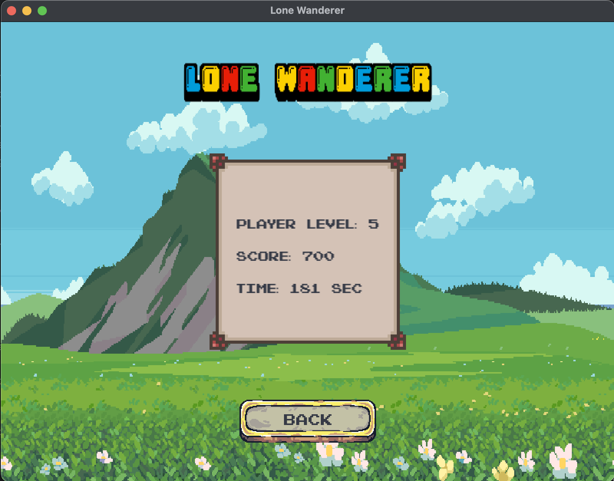

# 🎮 Lone Wanderer

**_Immerse yourself in an exciting adventure where you will fight enemies and improve your character. 
Dodge enemy attacks and defeat powerful bosses to become a true hero!_**

-----
### 🎲 Game functionality:
* Spawns a random enemy that moves towards character;
* When the timer expires the boss appears;
* Character attacks the nearest enemy;
* Enemies drop experience and have a chance to drop a health potion;
* By increasing the level and by purchasing a chest from the boss, you can improve your character's characteristics;
* The best game score is saved.

-----
### ⌨️ Control using:

Move Up ↑ or W

Move Down ↓ or S

Move Left ← or A

Move Right → or D

Left-click on the buttons

-----
### ▶️ Gameplay

Main window

Game process

Highscore window

-----
### 🎯 Next steps
1. [ ] Add skills to a character
2. [ ] Increase enemy difficulty as character levels up
3. [ ] Improvements and bugfixing
-----